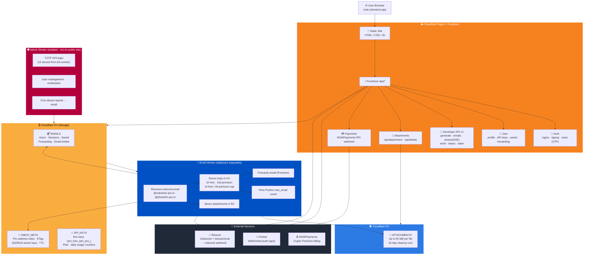

 # 📬 Phantom Mail - Disposable Email Service

<div align="center">

[](LICENSE)
[](https://mail.unknowns.app)
[](https://workers.cloudflare.com/)
[](https://github.com/Unknown-2829/Phantom-mail/stargazers)

**Privacy without limits. Invisible. Anonymous. Free.**

Disposable email on **`@unkn0wn.qzz.io`** and **`@phant0m.qzz.io`** — built entirely on Cloudflare with real-time Pusher delivery, crypto Premium via NOWPayments, and a Developer API.

[Live Demo](https://mail.unknowns.app) • [API Docs](https://mail.unknowns.app/api-docs.html) • [Report Bug](https://github.com/Unknown-2829/Phantom-mail/issues) • [Contact](mailto:support@unkn0wn.qzz.io)

</div>

---

## ⚡ Quick Deploy

Deploy your own Phantom Mail instance in minutes:

[](https://deploy.workers.cloudflare.com/?url=https://github.com/Unknown-2829/Phantom-mail)

Or follow the [detailed setup guide](#cloudflare-setup-guide) below.

---

## 🌟 Features

### Free Plan
- ✨ **Instant Email Generation** - Server generates a fresh, human-looking username on the `@unkn0wn.qzz.io` / `@phant0m.qzz.io` domains
- ⚡ **Real-time Inbox** - Pusher WebSocket push (`ap2` cluster) with ETag polling fallback — no manual refresh
- ⏱️ **1-Hour Self-Destruct** - Free addresses expire 1 hour after generation
- 📬 **10 Emails / Address** - Holds the latest 10 messages (oldest auto-deleted past 10)
- 💾 **1 Saved Address** - Keep one address on file with an account
- ✉️ **3 UI Sends / Day** - Send mail from the web app (account required)
- 🔒 **Private & Secure** - No tracking, no raw IP storage, no data selling
- 📎 **Attachment Support** - View and download attachments (images, PDFs, files) up to 50 MB
- 🔌 **Developer API** - Receive-only, 10 emails/day (API sending is blocked for free keys)

### Premium Plan ($5/mo or $40/yr — crypto via NOWPayments)
- 📅 **15-Day Retention** - Premium emails last 15 days (vs 1 hour for free)
- 📬 **45 Emails / Address** - 30 inbox + 15 starred per address
- 💾 **15 Saved Addresses** - Keep up to 15 addresses on file
- 🎯 **Custom Handle + Domain Choice** - Pick your handle and choose `@unkn0wn.qzz.io` or `@phant0m.qzz.io`
- 📨 **Email Forwarding** - Auto-forward to your real inbox
- ✉️ **25 UI Sends / Day** - Higher web-app send limit
- 🔌 **Developer API** - 500 receive/day **+** 50 send/day, plus SSE streaming
- 🛡️ **Priority Support** - Fast response from the team

> Additional **fair-use / abuse-protection** thresholds apply on top of the published quotas to keep the service healthy. Legitimate use never notices them.

---

## 🚀 Why Phantom Mail?

### vs TempMail / Guerrilla Mail / 10MinuteMail

| Feature | Phantom Mail (Free) | Phantom Mail (Premium) | Competitors |
|---------|---------------------|------------------------|-------------|
| **Email Retention** | 1 hour | **15 days** ⭐ | 10 mins - 1 hour |
| **Emails per Address** | 10 (latest) | **45** (30 + 15 starred) ⭐ | Usually ≤ 10 |
| **Saved Addresses** | 1 | **Up to 15** ⭐ | ❌ |
| **Custom Handle + Domain** | ❌ | ✅ | ❌ |
| **Email Forwarding** | ❌ | ✅ | ❌ (or paid only) |
| **Real-time Push** | ✅ Pusher | ✅ Pusher | Polling only |
| **Developer API** | 10 receive/day | **500 receive + 50 send/day** ⭐ | Limited or paid |
| **Attachment Support** | ✅ up to 50 MB | ✅ up to 50 MB | Limited or ❌ |
| **Open Source** | ✅ | ✅ | ❌ (most) |
| **No Ads** | ✅ | ✅ | ❌ (many have ads) |

**🔑 Key Advantage:** 15-day retention plus 45 emails/address for Premium means you never lose important verification emails or one-time codes.

---

## 📸 Screenshots

<div align="center">
  
  
  
</div>

---

## 🏗️ Architecture



> **Admin is fully isolated.** The admin panel is **not** served from the public Pages site — it runs on its own Worker with TOTP 2FA, and the admin UI is served from that worker itself.

---

## 📂 Project Structure

```
phantom-mail/
├── public/                          # Cloudflare Pages static site (NO admin panel here)
│   ├── index.html                   # Main app (inbox / compose / dashboard)
│   ├── premium.html                 # Premium purchase page (NOWPayments crypto)
│   ├── api-docs.html                # Developer API documentation
│   ├── privacy-policy.html          # Privacy policy
│   ├── terms.html                   # Terms of service
│   ├── acceptable-use.html          # Acceptable use policy
│   ├── app.js                       # Frontend app logic
│   ├── styles.css                   # Styling / design system
│   ├── sw.js · offline.html         # PWA service worker + offline fallback
│   ├── _headers · _routes.json      # Pages headers (CSP) + Functions routing
│   └── manifest.json                # PWA manifest
├── functions/
│   └── api/                         # Cloudflare Pages Functions (/api/*)
│       ├── _middleware.js           # In-code WAF: rate limiting, bans, security headers
│       ├── generate.js · emails.js  # Web UI: generate address / fetch inbox (ETag)
│       ├── emails/batch.js          # Web UI: batch inbox lookup
│       ├── send.js · sent.js        # Web UI: send mail (account required) / sent items
│       ├── email.js · email/raw.js  # Single message view / raw source
│       ├── attachment.js            # GET /api/attachment — serve R2 attachments
│       ├── delete.js                # DELETE /api/delete — server-side deletion
│       ├── claim.js                 # Ed25519 address re-claim (challenge-response)
│       ├── track.js · track/click.js# Open/click tracking (track.unkn0wn.qzz.io)
│       ├── config.js · qr.js        # Public config / QR proxy
│       ├── auth/                     # signin · signup · session · send-otp · reset-password
│       ├── user/                    # profile · api-key · saved-emails · forwarding · avatar
│       ├── pusher/auth.js           # Pusher private-channel auth
│       ├── payments/                # create.js · status.js (NOWPayments)
│       ├── webhooks/                # payment.js (NOWPayments IPN) · resend.js (inbound)
│       └── v1/                      # Developer API
│           ├── generate.js          # POST /api/v1/generate
│           ├── emails.js            # GET  /api/v1/emails
│           ├── emails/stream.js     # GET  /api/v1/emails/stream (SSE)
│           ├── send.js              # POST /api/v1/send (Premium only)
│           └── status.js            # GET  /api/v1/status
├── email-handler/                   # Inbound Email Worker (deploy separately)
│   ├── worker.js                    # Receives mail for both domains, writes KV/R2, Pusher push
│   └── wrangler.toml                # KV/R2 bindings + 15-day attachment cleanup cron
├── admin-worker/                    # Isolated Admin Worker (NOT served from Pages)
│   ├── worker.js                    # TOTP 2FA login, admin UI, moderation, cron reports
│   └── wrangler.toml                # KV bindings + admin secrets + report cron
├── LICENSE                          # MIT License
└── README.md                        # This file
```

---

<a id="cloudflare-setup-guide"></a>

## 🛠️ Cloudflare Setup Guide

### Prerequisites
- A Cloudflare account (free tier is sufficient)
- A GitHub account
- **Two mail domains** on Cloudflare (e.g. `unkn0wn.qzz.io` and `phant0m.qzz.io`) with Email Routing available
- Accounts for the external services: [Pusher](https://pusher.com) (Channels), [Resend](https://resend.com), and [NOWPayments](https://nowpayments.io)

### Step 1: Create KV Namespaces

1. Go to **Cloudflare Dashboard → Workers & Pages → KV**
2. Create these three namespaces:

| Binding Name | Purpose |
|--------------|---------|
| `EMAILS` | Users, sessions, saved addresses, forwarding rules, and received/sent email bodies |
| `INBOX_META` | Per-address inbox index + ETag, address TTL/expiry, and Ed25519 owner-key references for re-claim |
| `API_KEYS` | Developer API keys (`pm_free_*` / `pm_pro_*`), plan tier, and daily receive/send usage counters |

### Step 1b: Create R2 Bucket (for Attachments)

1. Go to **Cloudflare Dashboard → R2 → Create bucket**
2. Name it `phantom-mail-attachments` (or any name you prefer)
3. Note the bucket name — you'll bind it as `ATTACHMENTS` in the next steps

> Attachments up to 50 MB are stored in R2. A built-in daily cron job automatically deletes attachments older than 15 days.

### Step 2: Push to GitHub

```bash
git clone https://github.com/Unknown-2829/Phantom-mail.git
cd Phantom-mail

# Or fork the repo and clone your fork
git remote set-url origin https://github.com/YOUR_USERNAME/Phantom-mail.git
git push
```

### Step 3: Connect to Cloudflare Pages

1. Go to **Cloudflare Dashboard → Workers & Pages → Create → Pages**
2. Connect to Git → select your repository
3. **Build settings:**
   - Build command: *(leave empty)*
   - Build output directory: `public`
4. Click **Deploy**

### Step 4: Bind KV Namespaces and R2 Bucket to Pages

1. Go to your Pages project → **Settings → Functions → KV namespace bindings**
2. Add all three KV bindings:
   - Variable name `EMAILS` → select the `EMAILS` KV namespace
   - Variable name `INBOX_META` → select the `INBOX_META` KV namespace
   - Variable name `API_KEYS` → select the `API_KEYS` KV namespace
3. Go to **Settings → Functions → R2 bucket bindings**
4. Add the R2 binding:
   - Variable name `ATTACHMENTS` → select the `phantom-mail-attachments` R2 bucket
5. **Re-deploy** the Pages project after adding bindings:
   - Settings → Deployments → Retry deployment

### Step 5: Set Environment Variables & Secrets

Go to **Pages project → Settings → Environment variables** and add the following. Values marked *(secret)* should be added as **encrypted** secrets, not plaintext.

**Real-time (Pusher):**

| Variable | Required | Description |
|----------|----------|-------------|
| `PUSHER_APP_ID` | **Yes** | Pusher Channels app ID |
| `PUSHER_KEY` | **Yes** | Pusher public key (also used client-side) |
| `PUSHER_SECRET` *(secret)* | **Yes** | Pusher secret for signing channel auth |
| `PUSHER_CLUSTER` | **Yes** | Pusher cluster — use `ap2` |

**Email delivery (Resend):**

| Variable | Required | Description |
|----------|----------|-------------|
| `RESEND_API_KEY` *(secret)* | **Yes** | Resend API key for outbound & transactional mail (sends, OTP codes) |
| `RESEND_WEBHOOK_SECRET` *(secret)* | **Yes** | Verifies inbound/event webhooks from Resend (`/api/webhooks/resend`) |

**Payments (NOWPayments):**

| Variable | Required | Description |
|----------|----------|-------------|
| `NOWPAYMENTS_API_KEY` *(secret)* | **Yes** | NOWPayments API key for creating crypto invoices |
| `NOWPAYMENTS_IPN_URL` | **Yes** | Public IPN/webhook URL, e.g. `https://mail.unknowns.app/api/webhooks/payment` |

> ℹ️ **Note:** Email forwarding still uses Cloudflare Email Routing's `message.forward()` in the email worker. **Resend** is used for *outbound* sending, OTP/verification codes, and inbound event webhooks.

### Step 6: Connect Custom Domain

1. **Pages project → Custom domains → Set up a custom domain**
2. Add your app domain (e.g., `mail.unknowns.app`)
3. Follow Cloudflare's DNS verification steps

### Step 7: Deploy the Email Worker

The `email-handler/worker.js` is a **separate Cloudflare Worker** that receives inbound emails for **both** mail domains. It must be deployed independently of Pages.

1. From the repo, fill in your KV namespace IDs and R2 bucket in `email-handler/wrangler.toml`.
2. Deploy with Wrangler:
   ```bash
   cd email-handler
   npm install
   npx wrangler deploy
   ```
3. Set the worker's Pusher secret so it can push `new_email` events:
   ```bash
   npx wrangler secret put PUSHER_APP_ID
   npx wrangler secret put PUSHER_KEY
   npx wrangler secret put PUSHER_SECRET
   npx wrangler secret put PUSHER_CLUSTER   # ap2
   ```
4. Confirm the `EMAILS`, `INBOX_META` KV bindings and the `ATTACHMENTS` R2 binding are present (they are declared in `wrangler.toml`). The `wrangler.toml` also configures the daily attachment-cleanup cron trigger.

> ⚠️ **Important:** Forwarding destination addresses must be verified in **Cloudflare Email Routing**.
> When a premium user sets a forwarding address (e.g., `user@gmail.com`), that address must appear in **Email → Email Routing → Destination addresses** as a verified address. Cloudflare will send a one-time verification email — the user clicks the link, then forwarding works.

### Step 8: Configure Email Routing (for BOTH domains)

This routes inbound emails for each mail domain to the email worker. **Repeat for `unkn0wn.qzz.io` and `phant0m.qzz.io`.**

1. Go to **Cloudflare Dashboard → Email → Email Routing**
2. Select the domain
3. Under **Routing rules**, add a catch-all rule:
   - Action: **Send to a Worker**
   - Destination: select the email worker deployed in Step 7
4. Enable Email Routing for the domain if not already enabled
5. **Repeat all steps for the second domain.**

> ⚠️ **Without this step, emails sent to generated addresses on that domain will never arrive.**

### Step 9: Deploy the Admin Worker (isolated)

The admin panel is **not** part of the public Pages site. It runs as its own Worker (`admin-worker/`) with **TOTP 2FA**, and it serves its own admin UI.

1. Fill in KV bindings in `admin-worker/wrangler.toml` (at minimum `EMAILS`, plus any others it reports on).
2. Deploy and set its secrets:
   ```bash
   cd admin-worker
   npm install
   npx wrangler secret put ADMIN_PASSWORD       # admin login password
   npx wrangler secret put ADMIN_TOTP_SECRET     # base32 TOTP secret for 2FA
   npx wrangler secret put ADMIN_REPORT_EMAIL    # where scheduled abuse reports are sent
   npx wrangler deploy
   ```
3. The worker exposes the admin UI at its own route (e.g. a Worker subdomain or a dedicated custom domain) — **do not** map it onto the public app domain.

| Admin Secret | Required | Description |
|--------------|----------|-------------|
| `ADMIN_PASSWORD` *(secret)* | **Yes** | Admin login password |
| `ADMIN_TOTP_SECRET` *(secret)* | **Yes** | Base32 TOTP secret for 2FA |
| `ADMIN_REPORT_EMAIL` | **Yes** | Recipient for scheduled abuse/usage reports (cron) |

---

## 🔌 Developer API

Base URL: `https://mail.unknowns.app/api/v1`

Every API key ties to a Phantom Mail account. Free keys start with `pm_free_` (**receive-only**); Premium keys start with `pm_pro_` (receive **and** send). Authenticate with the **`X-API-Key`** header on every request (the SSE stream endpoint also accepts `?key=` because browser `EventSource` can't set headers).

### Endpoints

| Method | Endpoint | Description |
|--------|----------|-------------|
| `POST` | `/api/v1/generate` | Generate a disposable address (Premium may pick domain + custom handle) |
| `GET` | `/api/v1/emails` | Fetch emails for an address (supports `ETag` / `If-None-Match`) |
| `GET` | `/api/v1/emails/stream` | Real-time inbox stream over **SSE** (`init` / `new_email` / `deleted` / `error` / `bye`) |
| `POST` | `/api/v1/send` | Send an email — **Premium keys only** (free keys get `403`) |
| `GET` | `/api/v1/status` | Plan tier + today's receive/send usage |
| `POST` | `/api/v1/claim` | Re-claim a previously generated address via Ed25519 challenge-response |

### Get Your API Key

1. Sign up / sign in at [mail.unknowns.app](https://mail.unknowns.app)
2. Open **Dashboard → API Key** and generate your key
3. Or via API:

```bash
# Fetch your key (also syncs it to the API_KEYS namespace)
curl https://mail.unknowns.app/api/user/api-key \
  -H "Authorization: Bearer YOUR_SESSION_TOKEN"

# Generate a new key
curl -X POST https://mail.unknowns.app/api/user/api-key \
  -H "Authorization: Bearer YOUR_SESSION_TOKEN"
```

### Generate Temporary Email

```bash
curl -X POST https://mail.unknowns.app/api/v1/generate \
  -H "X-API-Key: pm_free_..." \
  -H "Content-Type: application/json"
```

**Response:**
```json
{
  "success": true,
  "address": "silentfox482@unkn0wn.qzz.io",
  "keyId": "k_9f3a...b21c",
  "expiresIn": 3600,
  "usage": { "today": 1, "limit": 10 }
}
```

### Get Emails for Address

```bash
curl "https://mail.unknowns.app/api/v1/emails?address=silentfox482@unkn0wn.qzz.io" \
  -H "X-API-Key: pm_free_..."
```

**Response:**
```json
{
  "success": true,
  "address": "silentfox482@unkn0wn.qzz.io",
  "count": 1,
  "emails": [
    {
      "id": "email_abc123",
      "from": "noreply@service.com",
      "subject": "Welcome to Service!",
      "timestamp": 1710743456789
    }
  ]
}
```

### Send an Email (Premium only)

```bash
curl -X POST https://mail.unknowns.app/api/v1/send \
  -H "X-API-Key: pm_pro_..." \
  -H "Content-Type: application/json" \
  -d '{
    "from": "me@phant0m.qzz.io",
    "to": "friend@example.com",
    "subject": "Hello from Phantom Mail",
    "text": "Sent via the Phantom Mail API."
  }'
```

### Plans & Limits (per key, per day, UTC reset)

| Capability | Free (`pm_free_`) | Premium (`pm_pro_`) |
|------------|-------------------|---------------------|
| **API receive** | 10 / day | 500 / day |
| **API send** | ❌ Blocked (`403`) | 50 / day |
| **SSE streaming** | ✅ | ✅ |
| **Custom handle / domain** | ❌ | ✅ |
| **Address retention** | 1 hour | 15 days |

> **Fair use:** additional undisclosed fair-use / abuse-protection thresholds apply on top of these quotas. Exceeding a published limit returns `429`; using a Premium-only feature on a free key returns `403`.

For full request/response schemas, the SSE examples (JS + Python), and the Ed25519 claim flow, see [mail.unknowns.app/api-docs.html](https://mail.unknowns.app/api-docs.html).

---

## 📜 License

This project is licensed under the **MIT License** - see the [LICENSE](LICENSE) file for details.

---

## 🤝 Contributing

Contributions are welcome! Please feel free to submit a Pull Request.

1. Fork the repository
2. Create your feature branch (`git checkout -b feature/AmazingFeature`)
3. Commit your changes (`git commit -m 'Add some AmazingFeature'`)
4. Push to the branch (`git push origin feature/AmazingFeature`)
5. Open a Pull Request

---

## 💬 Support

- 📧 **Support Email:** [support@unkn0wn.qzz.io](mailto:support@unkn0wn.qzz.io)
- 🐛 **Issues:** [GitHub Issues](https://github.com/Unknown-2829/Phantom-mail/issues)
- 📬 **Or just use the service itself** — generate an address and email us! 😉

---

## ⚠️ Legal

- [Privacy Policy](https://mail.unknowns.app/privacy-policy.html)
- [Terms of Service](https://mail.unknowns.app/terms.html)
- [Acceptable Use Policy](https://mail.unknowns.app/acceptable-use.html)

**Important:** This service is for legitimate privacy protection. Do not use for spam, phishing, fraud, or illegal activites.

---

<div align="center">

**Made with ❤️ by [Unknown](https://github.com/Unknown-2829)**

</div>
